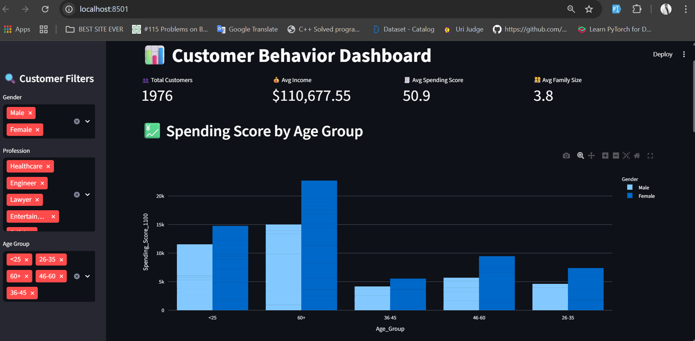
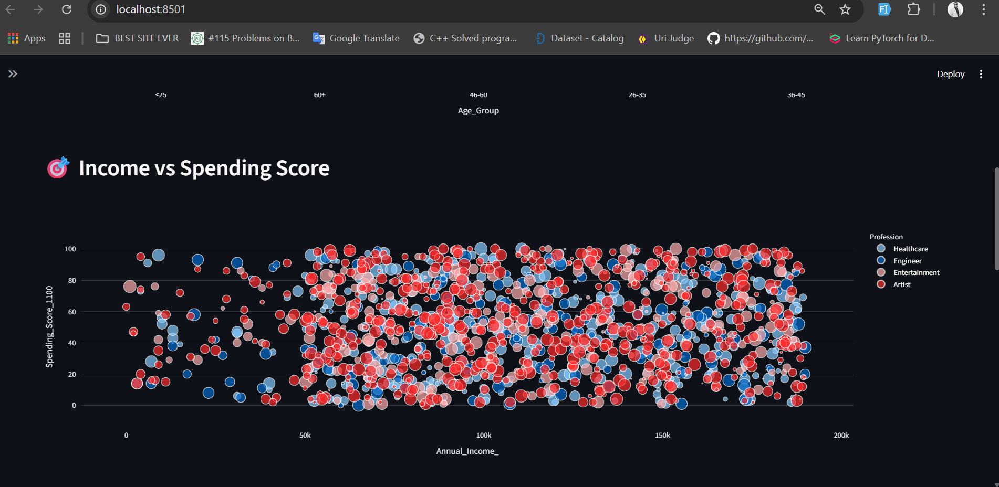
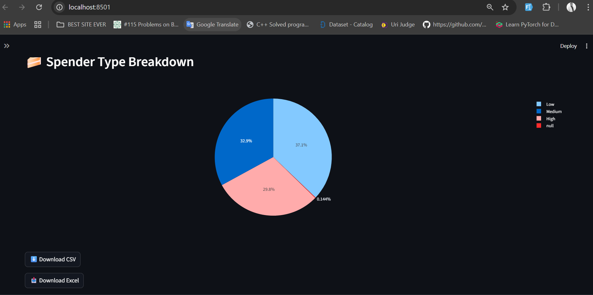
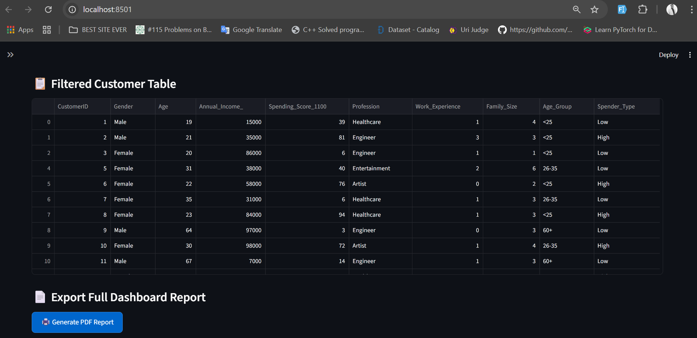

# 📊 Customer Behavior Dashboard – Streamlit App

This is a web-based interactive dashboard built using **Streamlit**, **Pandas**, and **Plotly**. It helps visualize and analyze customer behavior from a dataset, making it easier to uncover trends, insights, and KPIs that are critical for decision-making.

---

## 🚀 Live Demo

👉 [Click here to view the deployed app](https://your-username.streamlit.app)  


---

## 🧠 Features

- 📈 Interactive visualizations with **Plotly**
- 🗂️ Filters and selection options for exploring customer data
- 📊 KPIs and trend analysis to understand customer behavior
- ⚡ Fast, responsive, and mobile-friendly UI

---

## 🛠️ Tech Stack

- **Frontend/UI**: [Streamlit](https://streamlit.io)
- **Data Manipulation**: [Pandas](https://pandas.pydata.org)
- **Charts & Graphs**: [Plotly](https://plotly.com/python/)

---


## 💻 How to Run Locally

```bash
# 1. Clone the repository
git clone https://github.com/aminul-42/Customer-Behavior-Dashboard-streamlit.git
cd Customer-Behavior-Dashboard-streamlit

# 2. Create virtual environment (optional but recommended)
python -m venv venv
source venv/bin/activate      # For Linux/macOS
venv\Scripts\activate         # For Windows

# 3. Install dependencies
pip install -r requirements.txt

# 4. Run the Streamlit app
streamlit run app.py


```

# 📸 Screenshots




